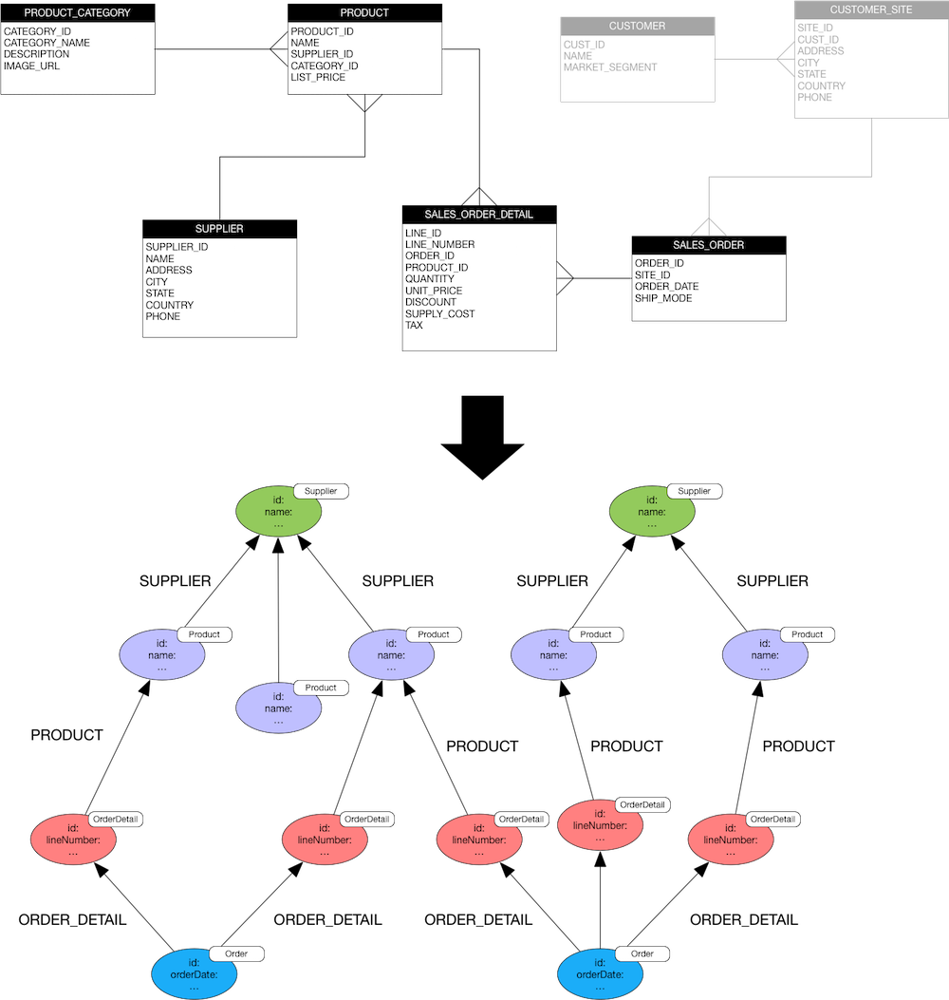

# Migrating from MySQL to Amazon Neptune using AWS Glue

This demo shows how to migrate relational data from MySQL to Amazon Neptune using AWS Glue.

The demo uses several different migration techniques:

- Extract data from MySQL to Amazon S3 as CSV files. Bulk load from the CSV files into Neptune.
- Extract data from MySQL and write it directly to Neptune.
- Incrementally load data from MySQL to Neptune.

The two data models are shown below. The MySQL database contains details of products, suppliers, orders and customers. The demo shows us migrating products, suppliers and orders data, but not customer data – though there's no reason it couldn't be expanded to also migrate customer data. We leave that as an exercise for the reader.

The scripts for the AWS Glue jobs can be found [here](https://github.com/aws-samples/amazon-neptune-samples/tree/master/gremlin/glue-neptune/glue-jobs/). The scripts use the [glue_neptune](https://github.com/awslabs/amazon-neptune-tools/tree/master/glue-neptune) Python library.

## Setup

Install the components using CloudFormation:

| Region | Stack |
| ---- | ---- |
|US East (N. Virginia) |   |
|US East (Ohio) |   |
|US West (Oregon) |   |
|EU (Ireland) |   |
|EU (London) |   |
|EU (Frankfurt) |   |

Once the stack creation has completed, open the Outputs tab of the *mysql-2-neptune* root stack, and click on the *SageMakerNotebook* URI. This will open an Amazon SageMaker Jupyter notebook. Navigate to the */Neptune/glue-neptune/ directory. From there you can complete each of the migration steps.

### Step 1 – Prepare the Environment

In this notebook we prepare the environment – loading data into MySQL, and crawling the database in order to populate the AWS Glue data catalog.

### Step 2 – Export from MySQL to S3 and then Bulk Load from S3

In this notebook we trigger a one-off export of data from MySQL to Neptune via S3. We use an AWS Glue job to export product, product category and supplier data to CSV files, which the job copies to S3. We then use the Neptune bulk load API to load the data from S3 into Neptune.
  
### Step 2 (Alternative) – Export Direct from MySQL to Neptune
  
In this notebook we look at an alternative method for exporting data from MySQL to Neptune. Instead of exporting to CSV files and using the Neptune bulk loader to load the data into Neptune, we use an AWS Glue job that extracts data from MySQL and inserts it directly into Neptune.
  
### Step 3 – Incremental Import from MySQL to Neptune

In this notebook we incrementally export frequently changing orders and order details data from MySQL into Neptune.

## License Summary

This sample code is made available under a modified MIT license. See the LICENSE file.
